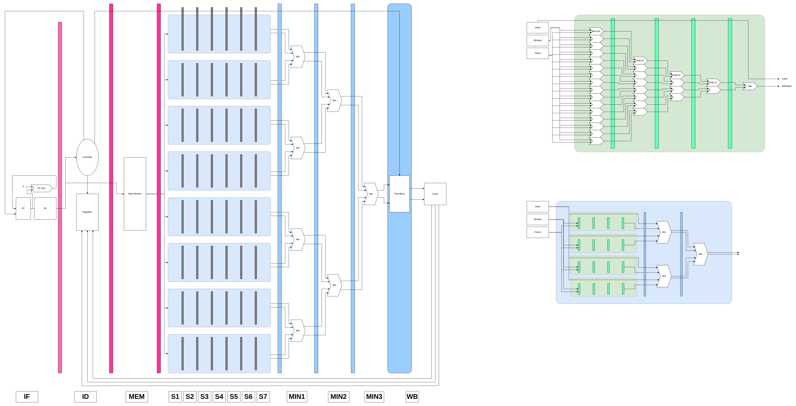

# ECE 369A Lab & Competition Projects

## Description

This repository contains a series of labs and a final competition project developed for **ECE 369A: Fundamentals of Computer Organization**. Throughout the course, students design and implement MIPS CPU architectures in Verilog, building from a single-cycle processor to a fully pipelined datapath on a Xilinx Artix-7 FPGA. In the final competition, teams created a **custom variable block size motion estimator (VBSME) datapath** using custom assembly and Verilog for optimized performance.

**Course Overview**  
ECE 369A dives into the fundamentals of computer architecture, focusing on CPU, memory, registers, arithmetic units, control logic, and performance trade-offs. Students learn instruction-set design using MIPS, culminating in a hands-on implementation of pipelined architectures and advanced designs for real-world computing demands.

## Table of Contents

- [Description](#description)
- [Competition Design](#competition-design)
- [Contents](#contents)
- [Features](#features)
- [Technology](#technology)
- [Lessons](#lessons)
- [Overview / Retrospective](#overview--retrospective)

## Competition Design

For the final competition, our team developed a **paralleled variable block size motion estimator (VBSME)** in Verilog, complete with custom assembly for efficient data sequencing and control. The design:
- Implements multiple parallel "cores" (threads) to compute the sum of absolute differences (SAD) across different window offsets concurrently.
- Uses pipeline stages for each step of the main calculation processes (Sum of Absolute Difference - SAD, Minimum comparisons - MIN) to maximize throughput.
- Merges partial results through minimum-comparison pipelines to find the optimal motion vector with minimal distortion.
- Targets a Xilinx Artix-7 FPGA, showcasing a real hardware implementation of an advanced image/video processing concept.

**Competition Simulation Results**  
- **Path Delay:** 9.067 ns  
- **Cycle Count:** 150  
- **Execution Time:** 1356 ns  

## Contents

- **Lab1 to Lab7 Directories**  
  Each lab builds on the previous, incrementally implementing components of the MIPS datapath:
  - **Lab1:** Basic instruction fetch unit, program counter, memory.  
  - **Lab2 & Lab3:** Intro to MIPS assembly, debugging, and early design blocks.  
  - **Lab4, Lab6 & Lab7:** Progressive development of single-cycle, then pipelined MIPS datapaths. Includes hazard detection, register forwarding, ALU, and memory integration.

- **Competition Directory**  
  - **Custom Paralleled VBSME Datapath** (`FinalBoss.v`, `Thread.v`, etc.): Integrates a complex motion estimation algorithm with multiple pipeline stages for parallel processing.
  - **MemFiles/**: Contains memory initialization files (`.mem`) and references for data and instructions.
  - **CoordinatesUnit.v, Core.v, SubUnit.v:** Key modules that manage block-based motion estimation in parallel.

- **HW1**  
  - Documentation or assignment instructions for the earliest theoretical portion of the course.

- **Images/**  
  - Includes `Lab4-PipelinedDataPath.jpg`, `Lab4-SingleCycle.jpg`, and `CompetitionDesign.png` illustrating high-level overviews of the datapaths.

- **MipsInstructionSetReference.pdf**  
  - A reference manual for the MIPS32 instruction set, crucial for verifying instruction formats and functionality.

- **README.md**  
  - This file, describing the repository structure and project highlights.

## Features

- **Incremental Lab Structure**  
  Demonstrates the step-by-step evolution of a CPU from basic instruction fetching to a multi-stage pipelined design with hazard detection and data forwarding.
- **Custom Assembly & Verilog Integration**  
  Combines MIPS assembly code with Verilog hardware modules to implement and test the CPU’s functionality.
- **Variable Block Size Motion Estimation (Competition)**  
  Uses parallel hardware blocks to handle complex image/video processing tasks, showcasing advanced performance optimization.
- **FPGA Deployment**  
  Targets a **Xilinx Artix-7 FPGA**, enabling real-time testing and performance analysis of the hardware designs.
- **Performance & Verification**  
  Emphasizes thorough testing with memory (.mem) files and custom test benches to ensure correctness and efficiency.

## Technology

- **Hardware Description Language:**  
  Verilog (primary language for CPU design)
- **Assembly Language:**  
  MIPS32 for instruction-level design and algorithm implementation
- **Scripting & Utilities:**  
  - Python (for generating or manipulating `.mem` files)  
  - Tcl (commonly used in the Xilinx toolchain)  
- **Tools & Environment:**  
  - Xilinx Vivado / ISE for synthesis and implementation on Artix-7 FPGAs  
  - Simulation and test bench frameworks (ModelSim, Vivado simulator, etc.)

## Lessons

- **Computer Architecture Fundamentals:**  
  Learned how pipeline stages (IF, ID, EX, MEM, WB) interconnect and the importance of hazard detection and forwarding.
- **Performance Trade-Offs:**  
  Explored how design choices (e.g., pipeline depth, hazard handling) impact clock cycles, throughput, and area usage.
- **Hardware-Software Co-Design:**  
  Combined custom assembly with hardware modules, emphasizing synergy between ISA design and datapath implementation.
- **Complex Module Integration:**  
  Gained experience structuring large Verilog projects, creating reusable modules, and ensuring consistent interfaces.
- **Team Collaboration:**  
  Worked closely with peers (@jlujan209, @tgentrup) to integrate and debug large-scale designs in a shared repository.

## Overview / Retrospective

- **What Went Well:**  
  - Achieved functional multi-stage MIPS pipelines, validating each component with thorough test benches.  
  - Successfully created a parallel VBSME datapath for the competition, utilizing advanced design patterns.  
  - Learned to balance design complexity with feasibility under real resource constraints on the FPGA.
- **Areas for Improvement:**  
  - Enhanced documentation and code commenting for easier understanding of module interconnections.  
  - More automated testing or continuous integration to streamline hardware simulation and regression tests.  
  - Possibly incorporate higher-level simulation or debugging tools to reduce manual verification efforts.
- **Future Enhancements:**  
  - Extend the MIPS ISA coverage to include advanced instructions or co-processor support.  
  - Integrate a cache or more elaborate memory hierarchy for deeper exploration of memory performance.  
  - Expand the VBSME competition project with additional optimization or custom instructions to accelerate motion estimation tasks.

## For Students in ECE369A...

This repository is intended **for reference and learning purposes only**. If you're a student reviewing this work:

- Hello, I hope you are enjoying the class.
- **Do Not Copy** this project into your own submissions (you'll probably get caught).  
- **Use It Responsibly:** Feel free to explore the concepts, analyze the designs, or learn from the structure—then apply these insights to your own unique solutions.

Sharing this code is meant to help you understand computer architecture and project structure, **not** to replace your own effort or violate academic policies. Our competition design was really good (would've came first by a longshot if we hadn't forgotten to print results to the seven segment display), but it could've been better. It's your job to make one better :) Good luck.
